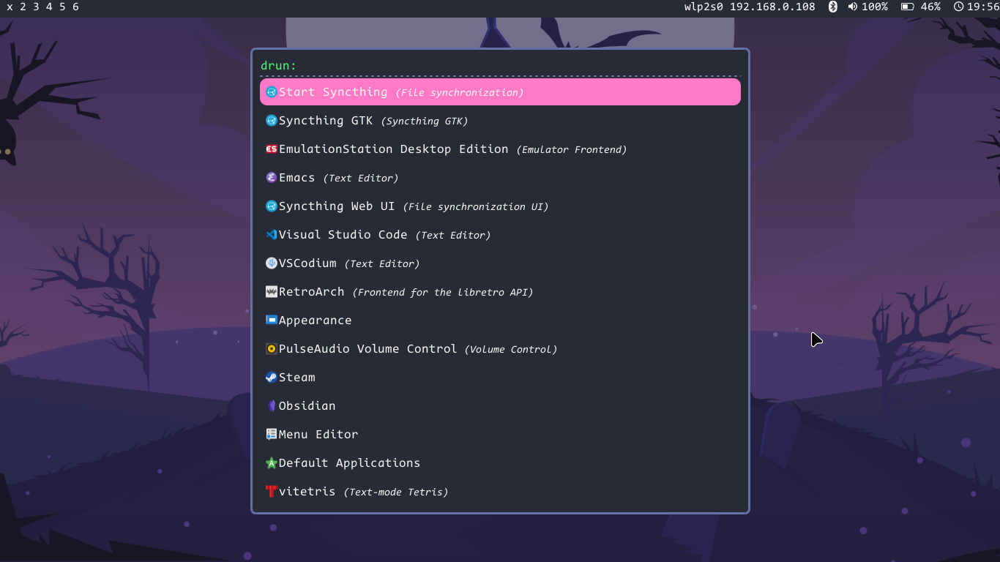

# dracula-rofi-theme
[Rofi](https://github.com/davatorium/rofi) theme based on [the original](https://github.com/dracula/rofi).

# Installing
1. Clone this repo `git clone https://github.com/deadendpl/dracula-rofi-theme.git`
2. Go into downloaded folder `cd dracula-rofi-theme`
3. Move theme into ~/.local/share/rofi/themes `cp dracula.rasi ~/.local/share/rofi/themes`
4. Open rofi in run mode `rofi -show run`
5. Choose rofi-theme-selector
6. Find and choose dracula and press alt+a to set it as default theme

# Font issue
This theme uses [CodeNewRoman Nerd Font][https://www.nerdfonts.com/font-downloads].
If you don't have this font installed on your system then theme will break.
To prevent this or switch fonts go to dracula.rasi and delete font: `"CodeNewRoman Nerd Font Regular 13";` or replace with your chosen font.
